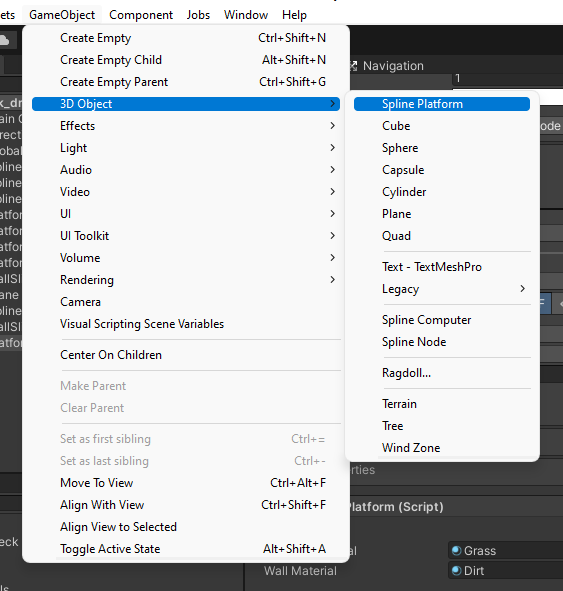

# ANIM T380 - Final

## Unity Platform Generator

### Description

- This tool lets you build procedural platforms in Unity using a spline tool.

### Dependencies

- [Dreamteck Splines](https://assetstore.unity.com/packages/tools/utilities/dreamteck-splines-61926): A Unity package that allows you to draw and generate meshes from splines. 

### Creating a Platform
- To create a platform, click `GameObject` -> `3D Object` -> `Spline Platform`

### Arguments

Unity Interface:

- Materials
    - `Surface Material` - Material for platform's top mesh
    - `Wall Material` - Material for platform's side mesh
- Surface
    - Shape
        - `Depth` - Depth of the top mesh
        - `Expand` - Buffer size of the top mesh. 
    - UV Coordinates
        - `UV Scale` - UV scale of the top surface of the top mesh
        - `Side UV Scale` - UV scale of the side surface of the top mesh
- Wall
    - Shape
        - `Depth` - Depth of the wall mesh
        - `Curve` - Curve of the wall mesh. Straight down by default.
        - `Curve Scale` - Scale of the curve's influence. 0 is none, 10 is one-to-one with the curve graph.
        - `Resolution` - The number of rows of quads in the side mesh. A higher resolution is needed to for more detailed cures.
    - UV Coordinates
        - `UV Scale` - UV scale of the wall mesh
- `Bake Meshes`
    - Bakes the surface and wall meshes. This locks them in place and stops the spline from controlling them. Can be undone by clicking `Revert Bake`.

### Examples

- 
